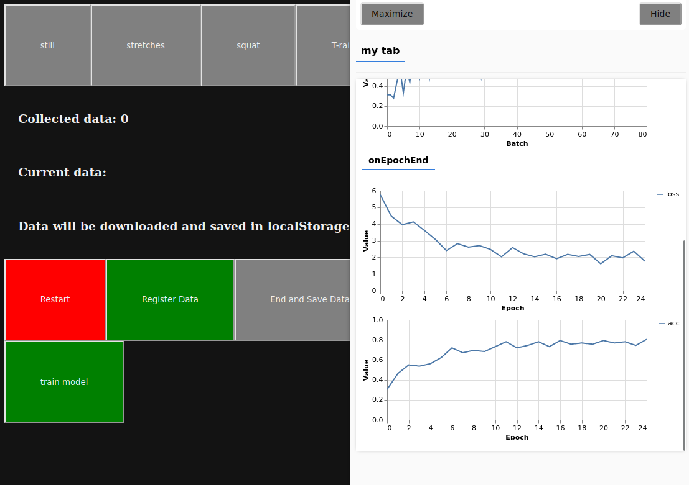
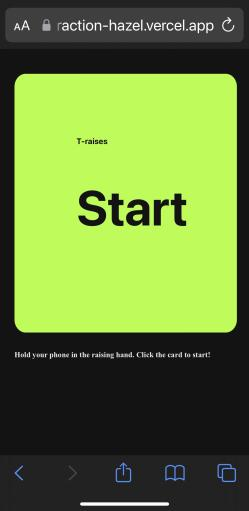

<h1 align="center">
Movement Detection Core
</h1>

<h6 align="center">
This is the movement detection core app for a serious game project. 
<br />
<a href="https://interaction-hazel.vercel.app/fitness">View Demo</a>
·
<a href="https://github.com/cy-moi/TfjsBoilerPlate/issues">Report Bug</a>

</h6>

---

<br />
Collect data and train model online



Try out page  




# How to run

**Node version: 16.xx.x is required**

1. Clone the repository

```bash
$ git clone
```

2. Install dependencies

```bash
$ yarn install --frozen-lockfile
```

3. Build the project

```bash
$ yarn build
```

4. Run the project locally

```bash
$ yarn start
```

Refer to `package.json` and `yarn.lock` if any pacakge version conflicts happen. Remove `yarn.lock` file if you are not using `yarn`.


